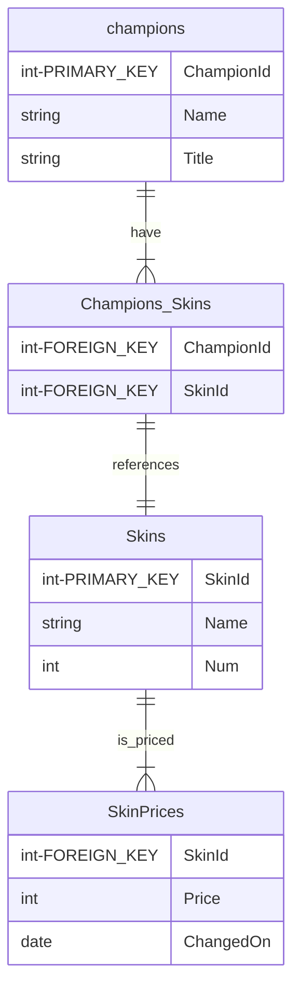

# League of Legends Skins Prices
<p align="center">
    
</p>

<p align="center">
  <a href="#presentation">Presentation</a> •
  <a href="#how-to-run">How To Run</a> •
  <a href="#how-it-works">How It Works</a> •
  <a href="#credits">Credits</a> •
  <a href="#todo">TODO</a> 
</p>

## Presentation
**Note : This repo is part of a last year project at ENSAI school. The subject can be [found here](docs/Sujet%20projet%20g%C3%A9nie%20logiciel.pdf). As a result, this project is not intended for production use. Several issues are present in the code, such as potential SQL Injection.**


Skins are cosmetic in the game League of Legends. They can be bought for real money and are sometimes on sales. The goal of this project is to track the prices of skins and to notify the user when a skin he likes is on sales.

### Features
- See all the skins and their current prices on the website
- Create an account and add your favorite skins to your list
- Receive an email when some skins you like are on sale

### Tech stack
- Logging system
- React frontend
- PostgreSQL database
- Backend API using FastAPI

## How to run
### Requirements
```
sudo apt  install git
sudo apt  install docker
sudo apt  install docker-compose
```
### Install App
First, clone the repository :
```
git clone https://github.com/AlexandreBidon/LoL-Skins-Prices.git
```
Add a `.env` file in directory with the following variables :
```
MAIL_ADDRESS=
MAIL_PASSWORD=
```
Those variables are used to send notification mail when a skin is in sale.

### Run App

You can then run the app with `docker-compose` like this :
```
docker compose up --build
```

You can then access
- the API at http://localhost:3000
- the website at http://localhost:80

### Demonstration


### Launch the tests

## How it works
### API
**[The list of all the endpoints can be found here](docs/ENDPOINTS.md)**.
You can also see

### Database

### Frontend
<p align="center">
    
</p>

### Mailing system
<p align="center">
    
</p>

## Credits
### Authors
- Tiroumalai Freddy ([tiroumalaifreddy](https://github.com/tiroumalaifreddy))
- Bidon Alexandre ([AlexandreBidon](https://github.com/AlexandreBidon))

## TODO
- Revamp database object to prevent SQL Injection (remove `"".format()`)
- Improve the handling of Exceptions in the API : returns the good error code
- Add authentification for users in the API
- Add more tests (mock DB and mail object)
- Improve the frontend : add a user page to control the account from here