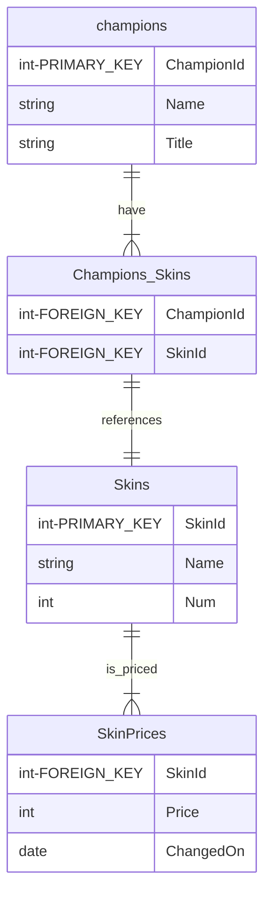

# League of Legends Skins Prices
<p align="center">
    
</p>

<p align="center">
  <a href="#presentation">Presentation</a> •
  <a href="#how-to-run">How To Run</a> •
  <a href="#how-it-works">How It Works</a> •
  <a href="#credits">Credits</a> •
  <a href="#todo">TODO</a> 
</p>

## Presentation
**Note : This repo is part of a last year project at ENSAI school. The subject can be [found here](docs/Sujet%20projet%20g%C3%A9nie%20logiciel.pdf). As a result, this project is not intended for production use. Several issues are present in the code, such as potential SQL Injection.**


Skins are cosmetic in the game League of Legends. They can be bought for real money and are sometimes on sales. The goal of this project is to track the prices of skins and to notify the user when a skin he likes is on sales.

### Features
- See all the skins and their current prices on the website
- Create an account and add your favorite skins to your list
- Receive an email when some skins you like are on sale

### Tech stack
- Logging system
- React frontend
- PostgreSQL database
- Backend API using FastAPI
- CI/CD using Github workflows
- Python Scripts to scrap new prices (not implemented in docker compose)

## How to run
### Requirements
```
sudo apt  install git
sudo apt  install docker
sudo apt  install docker-compose
```
### Install App
First, clone the repository :
```
git clone https://github.com/AlexandreBidon/LoL-Skins-Prices.git
```
Add a `.env` file in directory with the following variables :
```
MAIL_ADDRESS=
MAIL_PASSWORD=
```
Those variables are used to send notification mail when a skin is in sale.

### Run App

You can then run the app with `docker-compose` like this :
```
docker compose up --build
```

You can then access
- the API at http://localhost:80
- the website at http://localhost:3000

## Demonstration

In this section, we present a way to test all the features of the projet.

### Adding champions and skins
 
 We will learn how to add the following skin into the app :
 
<p align="center">
    
    
</p>
<p align="center"><b>Championship Kalista</b></p>

Start by running the application. Once the application is running, go to the website at http://localhost:3000. Search the skin `Championship Kalista`. There should be no result. That is because the skin and it's associated champion are not added by default in the app.

<p align="center">
    
    
</p>
<p align="center"><b>No result found when we search Championship Kalista</b></p>


### Let's add a champion to the app

So to add the skin `Championship Kalista` into the app, we first need to add the champion `Kalista`.

Because we are using the Riot API to have the skins images, we need to provide the right information to our API.

To add the champion we will use a `POST` operation on the endpoint `/champions`. The easiest way to do so is to go to the documentation at http://0.0.0.0/docs#/default/create_champion_champions_post. You can then use the "Try it out" feature to create Kalista.
To do so you will have to provide the following information :
```json
{
  "champion_id": 429,
  "name": "Kalista",
  "title": "the Spear of Vengeance"
}
```
Once you execute the `POST` operation you should see this result ```{"success": true}```. That means that the champion was successfully added to database!

### Adding a new skin

We can now do the same process to add the skin to the app. In the documentation find the `POST` `/skins` endpoint. We will use the "Try it out" feature to add Championship Kalista.
You will have to add the following data:
```json
{
  "champion_id": 429,
  "skin_id": 429002,
  "name": "Championship Kalista",
  "skin_num": 2,
  "base_price": 2000
}
```

Just like before, you should have a result ```{"success": true}```. We can now go back to the website to see if the skin is here. Once we have refreshed the website we can see the skin!
<p align="center">
    
    
</p>
<p align="center"><b>Championship Kalista is on the website</b></p>
### Creating a user account

### Updating the prices of skins

## How it works
### API
**[The list of all the endpoints can be found here](docs/ENDPOINTS.md)**.
You can also find all the endpoints in auto-doc at http://localhost:80/docs.

All `User` object have the comportement of an **observer**. They subscribe to the `UserAlert` to be notified of new prices on skins.

### Database

### Frontend

The website was made using **React**. It can be used to see all the skins and their current prices. It is not possible to create users, modify prices and see prices history from the site.

<p align="center">
    
</p>

### Mailing system
<p align="center">
    
</p>

## Credits
### Authors
- Tiroumalai Freddy ([tiroumalaifreddy](https://github.com/tiroumalaifreddy))
- Bidon Alexandre ([AlexandreBidon](https://github.com/AlexandreBidon))

## TODO
- Revamp database object to prevent SQL Injection (remove `"".format()`)
- Improve the handling of Exceptions in the API : returns the good error code
- Add authentification for users in the API
- Add more tests (mock DB and mail object)
- Improve the frontend : add a user page to control the account from here
- Add a way to plot price history for a skin (in the frontend)